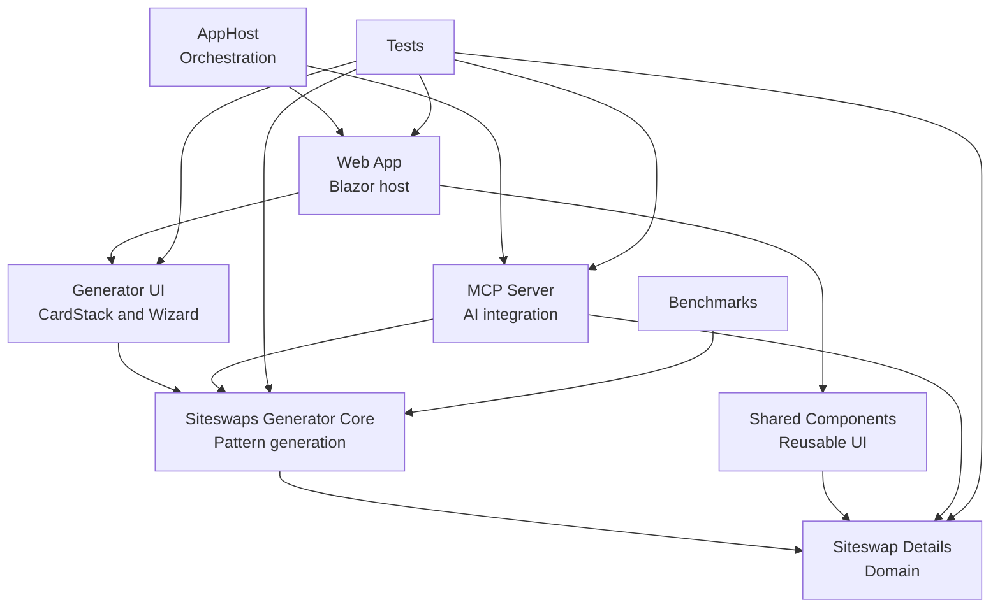

# Juggling

## Dependency boundaries

The dependency analyzer uses the node IDs in this diagram together with
`architecture.arch.json`. The labels are intentionally user-facing; the JSON
file maps each ID to the actual C# namespace prefixes.

<!-- arch-analyzer -->

Only the directed edges shown above are allowed between mapped namespaces.
External and unmapped namespaces remain outside this architecture boundary.
