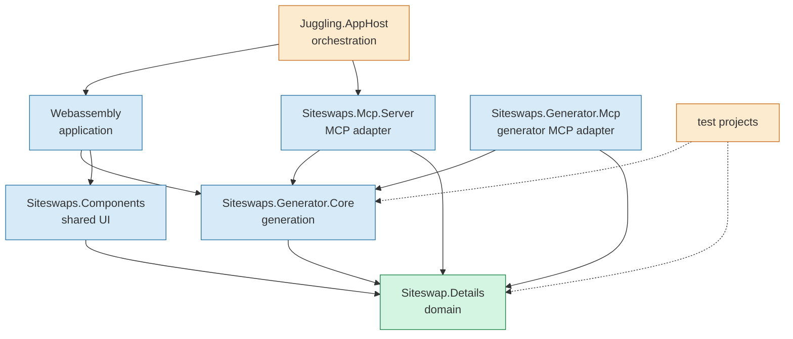

# Juggling

## Dependency boundaries

The project dependency graph is intentionally kept one-directional. The domain
(`Siteswap.Details`) is the innermost layer; UI, MCP, hosting, and test projects
may depend on it, but the domain must not depend on any of them.

The solid arrows are allowed production dependencies. Dashed arrows represent
test-only dependencies. New project references should be added to this diagram
and covered by an architecture test before they are merged.
