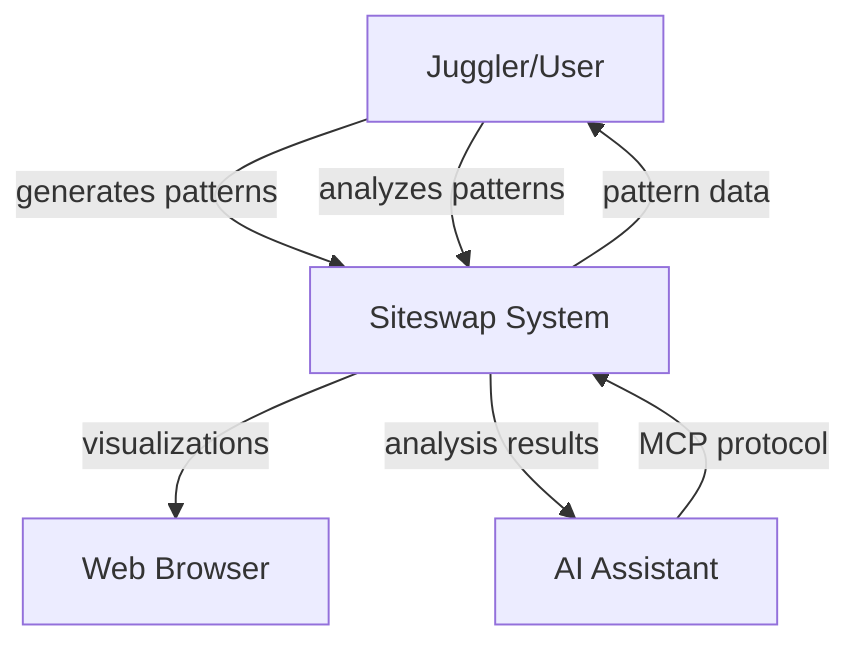
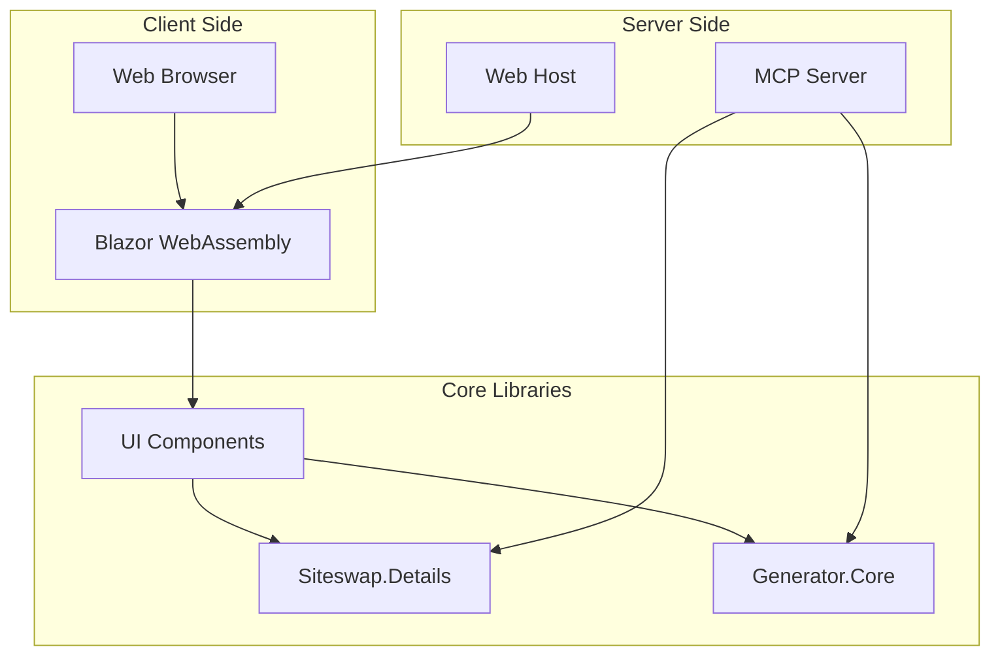

# System Context

## Business Context

### External Entities

| Entity | Interface | Purpose |
|--------|-----------|---------|
| **Juggler** | Web UI | Explore and learn patterns, plan routines |
| **AI Assistant** | MCP Server | Generate patterns via natural language, analyze specific patterns |
| **Web Browser** | HTTP/WebAssembly | Render UI, run client-side logic |

## Technical Context

### Technical Interfaces

| Interface | Technology | Data Format |
|-----------|------------|-------------|
| **Web UI** | Blazor WebAssembly + HTTP | HTML/CSS/JS, JSON |
| **MCP Server** | stdio/HTTP | JSON-RPC |
| **Library API** | .NET assemblies | In-memory objects |

