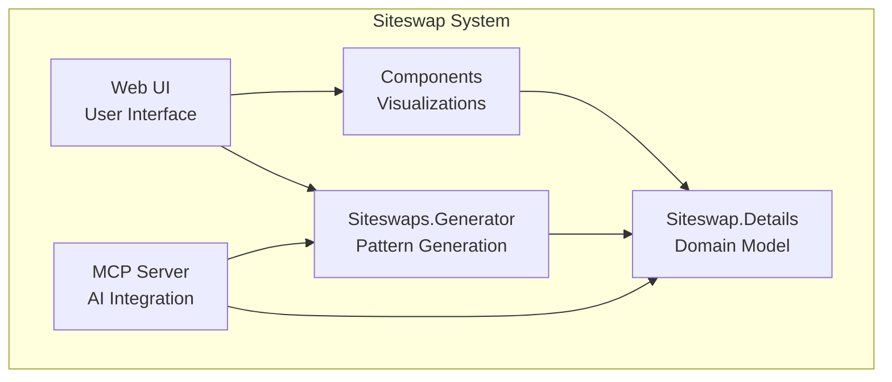

# Building Block View

## Level 1: System Overview

### Core Responsibilities

| Component | Responsibility |
|-----------|---------------|
| **Siteswap.Details** | Domain model, validation, analysis, mathematical operations |
| **Siteswaps.Generator** | Pattern generation with backtracking and filtering |
| **Components** | Reusable UI components for visualization |
| **Web UI** | User-facing application, layout, page routing |
| **MCP Server** | AI tool integration, external API |
