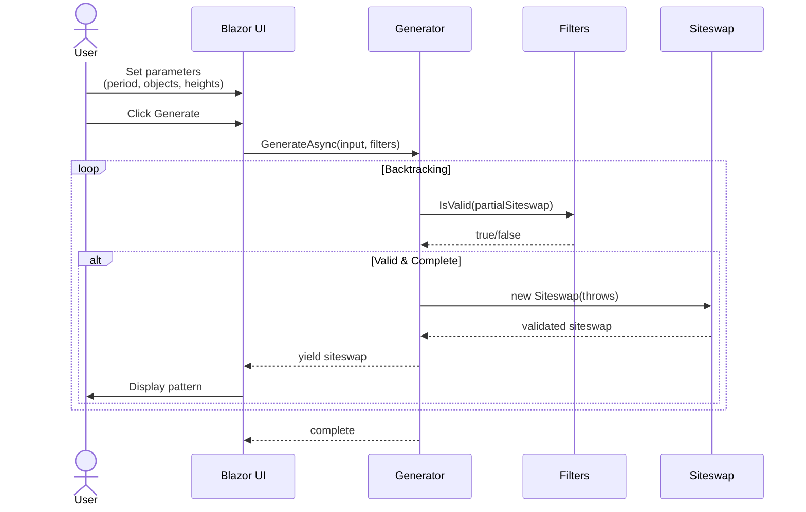
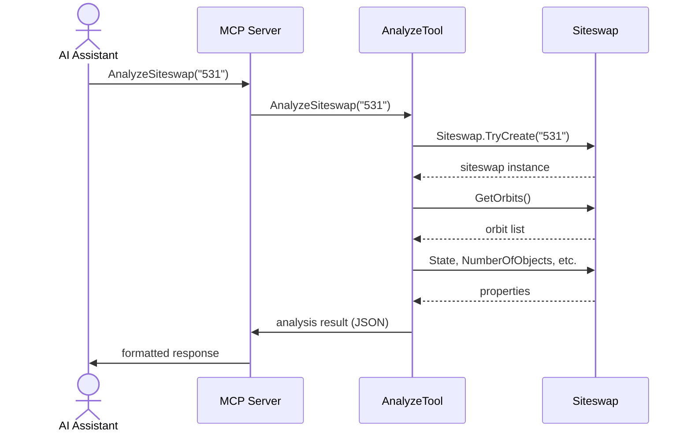
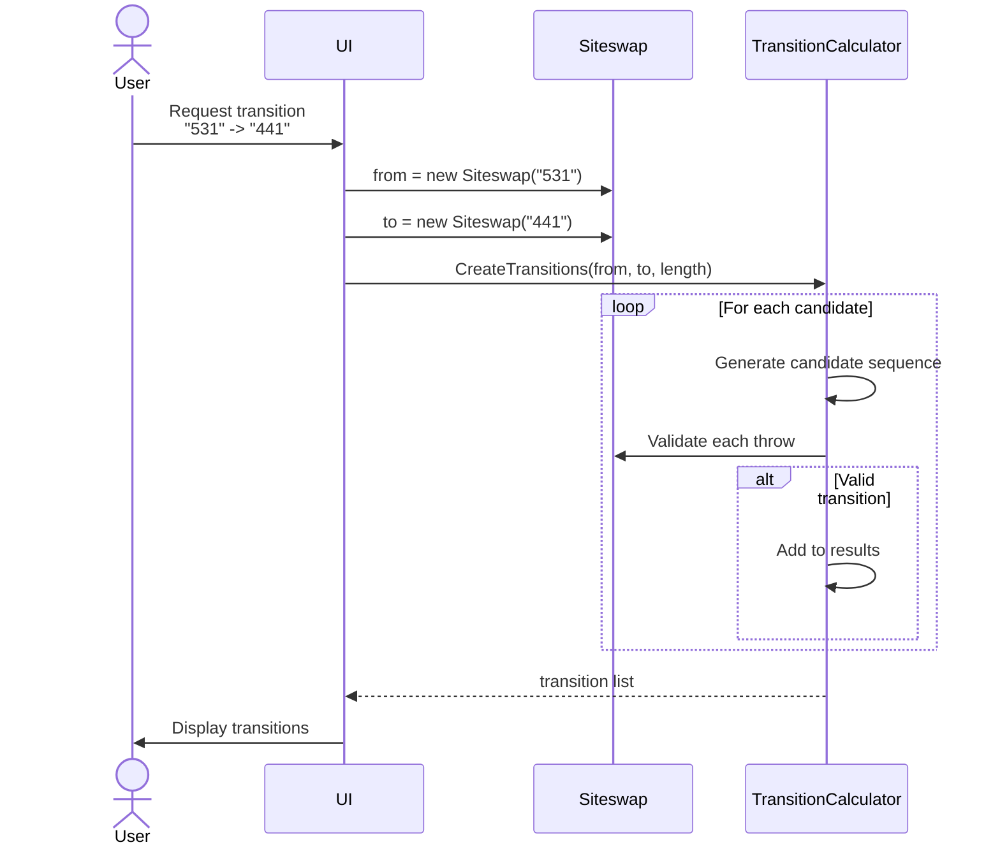

# Runtime View

## Scenario 1: Generate Siteswaps via Web UI

### Steps

1. User configures generation parameters in web interface
2. UI creates `SiteswapGeneratorInput` and filters
3. Generator starts backtracking algorithm
4. For each position, try all possible throw heights
5. Filters prune invalid branches early
6. Complete valid patterns are yielded incrementally
7. UI displays patterns as they arrive

## Scenario 2: Analyze Pattern via MCP

### Steps

1. AI assistant calls MCP tool with siteswap string
2. MCP server routes to `AnalyzeSiteswapTool`
3. Tool parses and validates siteswap
4. Tool queries domain model for properties
5. Tool calculates orbits, states, transitions
6. Results serialized to JSON
7. AI receives structured analysis data

## Scenario 3: Calculate Transitions

### Steps

1. User requests transition between two patterns
2. Both patterns validated as siteswaps
3. TransitionCalculator explores possible sequences
4. Each candidate validated for mathematical correctness
5. Valid transitions collected and sorted
6. UI displays clickable transition sequences

