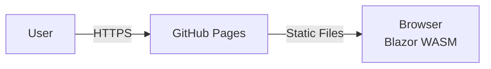

# Deployment View

## Deployment Options

### Option 1: Web Application (WebAssembly) - GitHub Pages

**Characteristics**:
- Client-side execution (no backend required)

**Deployment**: 
- Automated via GitHub Actions
- Deployed to GitHub Pages
- Available at repository's GitHub Pages URL
