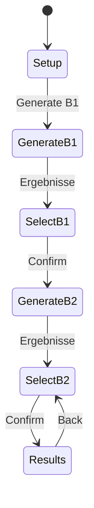

# Feeding (3-Personen-Feed)

Fachliche und technische Referenz für das Feeding-Feature: Domänenmodell, aktueller
Implementierungsstand, bekannte Fallstricke und offene Punkte.

> **Sprache**: Prosa auf Deutsch, Code-Begriffe (Pass, Self, Interface, TimeZone …)
> bewusst auf Englisch — genauso wie im Code. „Interface“ meint in der Siteswap-Fachsprache
> die Lande-Sicht (welcher Wurf auf welchem Beat landet); nicht mit dem Throw-Time-/Abwurf-Interface
> verwechseln.
>
> **Beat-Nummerierung**: Fachlich und in UI-Texten zählen Beats ab **1**. Arrays und Code-Indizes
> bleiben 0-basiert — **intern Index 0 = Beat 1**, Index 1 = Beat 2, usw. Formeln wie
> `(i + h) mod period` beziehen sich auf diese Indizes; in der Prosa stehen die Beats 1-basiert.
>
> **Verbindlichkeit**: Der Code ist die Wahrheit. Wenn dieses Dokument und
> `NormalFeedSession` / `InterfaceFilter` auseinanderlaufen, gilt der Code; dann bitte hier
> nachziehen.

---

## 1. Domänenmodell

### 1.1 Rollen und Topologie

Ein *Normal Feed* besteht aus drei Jongleuren:

| Rolle | Bedeutung | TimeZone | Passt an |
|-------|-----------|----------|----------|
| `A`   | Feeder    | 0        | `B1`, `B2` |
| `B1`  | Fedee 1   | 1        | nur `A` |
| `B2`  | Fedee 2   | 1        | nur `A` |

Definiert in `NormalFeed.Create()`. Die Topologie ist fix — es gibt aktuell keine anderen
Feed-Formen (kein Feed-Weave, kein 4-Personen-Feed).

Der Feeder spielt ein **festes 2-Personen-Siteswap** (aus der Details-Seite mitgegeben, Query
`?s=`). Dieses Muster wird nicht generiert, sondern als Vorgabe genommen. Generiert werden die
beiden **Paar-Muster** `A↔B1` und `A↔B2` — jeweils wieder 2-Personen-Siteswaps derselben Periode.

### 1.2 TimeZones und der halbe Schlag

`A` liegt auf TimeZone 0, `B1`/`B2` liegen beide auf TimeZone 1. Fachlich heißt das:

- Die beiden Fedees sind **synchron zueinander**.
- Sie sind gegenüber dem Feeder um einen **halben Schlag** versetzt.

In der UI wird dieser Versatz visualisiert: Die Wurfreihen in der Kombinationsansicht werden
horizontal um `stagger * pitch / jugglers` verschoben (CSS-Variablen `--feeding-stagger` und
`--feeding-jugglers`, Chip-Pitch `44px + 8px`) — exakt dieselbe Mechanik wie
`sdv-hero-throws` auf der Details-Seite. Abgesichert durch `FeedingBeatStaggerTests`.

### 1.3 Pass vs. Self

Die Unterscheidung ist überall dieselbe Regel — nicht nur für zwei Jongleure:

```
height % numberOfJugglers == 0  →  Self
height % numberOfJugglers != 0  →  Pass
```

Das steckt in `Siteswap.GetPassOrSelf` / `Interface.GetPassOrSelf`, in den Filter-Wildcards
(`InterfaceFilter`, Pattern-Filter: `-3` = Self, `-2` = Pass) und in
`FeedingThrowDisplay.Kind(height, numberOfJugglers)`.

Feeding erzeugt und bewertet **Paar-Muster** (`A↔B1`, `A↔B2`) und setzt dort
`NumberOfJugglersInPair = 2`. Dann ist die allgemeine Regel genau der bekannte Spezialfall
„gerade Höhe → Self, ungerade Höhe → Pass“ (`NormalFeedSession.ToPassOrSelf`). Der Empfänger
eines Passes kommt **nicht** aus dem Rest der Division: bei Feeding weist die Session den
Partner explizit zu (`CyclePass` / `AssignPass`); für N > 2 beschreibt der Rest modulo N
fachlich den Zieljongleur (siehe Generator-Guide), die Pass/Self-Klassifikation bleibt aber
nur das `== 0`-Kriterium.

### 1.4 Pass-Zuordnung: Free → B1 → B2 → Free

Im Setup-Schritt wird pro Wurf des Feeders eine Ziffer angezeigt (`feeding-digit-row`).
Nur **Pass-Ziffern** sind interaktiv; Selfs zeigen einen statischen `Self`-Hinweis.
Ein Klick auf den Chip zyklt die Zuordnung: `Free (null) → B1 → B2 → Free`
(`NormalFeedSession.CyclePass`).

Die Generierung bleibt blockiert, solange nicht jeder Pass eindeutig zugeordnet ist. Die Gründe
sind als `GenerationBlockCode` typisiert (statt als Strings), damit UI und Tests dieselbe Ursache
sehen:

| `GenerationBlockCode` | Bedeutung |
|-----------------------|-----------|
| `NoPasses`            | Feeder-Siteswap enthält gar keinen Pass |
| `IncompleteAssignments` | Mindestens ein Pass ist noch `Free` |
| `SingleFedeeOnly`     | Alle Pässe gehen an denselben Fedee |
| `ClubsUnset`          | Keulenschranken für `B1`/`B2` unplausibel |
| `None`                | Generierung möglich |

### 1.5 Der zentrale Punkt: Wurfzeit ≠ Landezeit

Das ist die wichtigste Erkenntnis der ganzen Analyse und die Quelle der meisten Missverständnisse:

> **Wer von A einen Pass bekommt und wer zu A passt, sind zwei unabhängige Entscheidungen.**

Genauer:

- **Throw-Time-Interface / Abwurf** (`ThrowTimeInterfaceFor(role)`): Auf welchen Beats *wirft*
  `A` einen Pass an diese Rolle. Das ist durch die Pass-Zuordnung **vollständig festgelegt**.
- **Interface** (`InterfaceFor(role)` bzw. `FeedInterface.RotateToLanding`): Welcher Wurf auf
  Beat `j` *landet*. Ein Wurf auf Beat `i` mit Höhe `h` landet auf Beat
  `((i_index + h) mod period) + 1` (mit `i_index = i - 1`). Das ist das Interface im üblichen
  Siteswap-Sinn.
- **Partielles Interface** (`PartialInterfaceFor(role)`): Maske für den Generator — auf manchen
  Beats schon `AnySelf` (Interface dort erzwungen), auf den übrigen Don't-Care. Wer zu A passen
  *darf*, steckt genau in den noch offenen Beats; frühere Fedees verengen die Maske.

Konsequenz, die im Gespräch immer wieder für Verwirrung sorgte: **`A` kann an `B1` werfen und
gleichzeitig von `B2` einen Pass bekommen.** Es gibt keinen Zwang, dass ein Pass „zurück“ auf
denselben Beat kommt.

Beispiel aus `FeedInterfaceContractTests` (Feeder `78627`, Pass auf Beat 1 an `B1`):

| Sicht | Beat 1 | 2 | 3 | 4 | 5 |
|-------|--------|---|---|---|---|
| Throw-Time / Abwurf für `B1` | **P** | S | S | S | S |
| Interface für `B1` | S | S | **P** | S | S |

Beide Sichten beschreiben dieselben Würfe, nur in unterschiedlicher Reihenfolge. Wer das
verwechselt, generiert konsistent falsche Muster.

### 1.6 Interface bei A (wer zu A passt)

Das Interface bei `A` sagt pro Beat, was dort ankommt: Self von A oder Pass eines Fedees.
Es gibt **kein** separates „Landing-Slot“-Konzept — Belegung und Kopplung sind nur **partielle
Information über dasselbe Interface**.

Kanonisches Beispiel (Feeder `75756`, Periode 5, vier Pässe — der Fall, für den die Kopplung
ursprünglich gemeldet wurde):

- Self von `A`: auf Beat 5 (Höhe 6) → landet auf Beat 1
  (intern Index 4; `(4 + 6) mod 5 = 0` = Beat 1)
- Interface dort erzwungen Self: Beat 1
- Offen für Pässe zu A: Beats **2, 3, 4, 5** → `OpenPassInterfaceBeats()` liefert die Indizes
  `[1, 2, 3, 4]`

In Realzeit liegt `A` auf `t = 0, 2, 4, 6, 8`, das entspricht den Beats `1, 3, 5, 2, 4`. Beat 1
ist das eigene Self, also läuft die **Pass-Belegung des Interfaces** über die Beats `3, 5, 2, 4`.

Feeding arbeitet mit **ungerader Periode** (wie `GetLocalPeriod`: beide Jongleure sehen die volle
Notation). Es gibt keine Throw-/Catch-Beat-Unterscheidung — Pass vs. Self und Interface reichen.

### 1.7 Pass-Belegung des Interfaces ist ein echter Freiheitsgrad

Vier offene Interface-Beats bei `A` bedeuten vier Stellen, an denen jemand zu A passt. Wenn
`B1` zwei davon bekommt und `B2` zwei, ist **die Reihenfolge trotzdem nicht festgelegt**. Diese
Muster sind fachlich verschieden:

| Interface-Belegung (Beats 3, 5, 2, 4) | Charakter |
|--------------------------------------|-----------|
| `B1 B2 B1 B2 · Self` | alternierend |
| `B1 B1 B2 B2 · Self` | blockweise |
| `B2 B1 B1 B2 · Self` | gespiegelt/verschachtelt |

`FeedCouplingTests.Arrival_Pattern_At_The_Feeder_Is_Completed_By_B2` zeigt, dass für `75756` mit
6 Keulen genau diese drei Muster erreichbar sind — und dass `B1B2B1B2` zwar erreichbar ist, aber
**null** gültige B2-Muster übrig lässt. Das Muster zu wählen ist also eine echte,
konsequenzenreiche Entscheidung, keine Darstellungsvariante.

### 1.8 Kopplung: B1 verengt B2s partielles Interface

Sobald ein Muster für `B1` ausgewählt ist, zwingt es auf den Beats, auf denen `B1` zu A passt,
das Interface auf Self für jeden späteren Fedee (`ForcedSelfInterfaceBeatsFor` /
`PartialInterfaceFor`). Diese Beats stehen `B2` nicht mehr als Pass-Ziel offen.

```
ForcedSelfInterfaceBeatsFor("B1") = Beats, auf denen Selfs von A landen
ForcedSelfInterfaceBeatsFor("B2") = Self-Beats von A  ∪  Beats, auf denen B1 zu A passt

PartialInterfaceFor(role) =
  AnySelf auf ForcedSelfInterfaceBeatsFor(role), Don't-Care sonst
```

Die Reihenfolge in `FedeeOrder = ["B1", "B2"]` ist **absichtlich gerichtet**: `B1` wird nie von
`B2` eingeschränkt. Dadurch bleibt „B1 nochmal anders wählen“ jederzeit möglich; stattdessen wird
`B2` invalidiert (`DropSelectionsIncompatibleWith`).

Wichtig für die Erwartungshaltung: Die B2-Ergebnisliste ist **nicht** die B1-Liste. Sie ist
systematisch kleiner, und zwar abhängig vom *konkret gewählten* B1-Muster, nicht von der
Pass-Zuordnung. Auch das ist getestet
(`Different_B1_Arrivals_Leave_Different_Options_For_B2`).

---

## 2. Interface-Filter vs. Pattern-Filter

Historisch gab es nur Pattern-Filter. Die reichten für Feeding nicht, weil sie die **falsche
Achse** beschreiben.

| | Pattern-Filter (`NewPatternFilterInformation`) | Interface-Filter (`InterfaceFilterInformation`) |
|---|---|---|
| Slot `j` beschreibt | den Wurf, der **auf Beat `j` gemacht** wird (Throw-Time / Abwurf) | den Wurf, der **auf Beat `j` landet** (Interface) |
| Passt zu | Wurfreihenfolge / lokale Notation | Kausalstruktur, Interface bei A, Feeding |
| Rotationsmodi | `Absolute`, `Global`, rotationsflexibel | `AllowRotation` (bool) |

### 2.1 Wildcards

Beide Filter nutzen dieselben Sonderwerte (siehe auch `docs/arc42/12-glossary.md`):

| Wert | Bedeutung |
|------|-----------|
| `-1` | `DontCare` — beliebig |
| `-2` | `Pass` — `height % numberOfJugglers != 0` |
| `-3` | `Self` — `height % numberOfJugglers == 0` |

### 2.2 Warum eine kombinierte Maske nötig war

`InterfaceFilter` nimmt optional **zusätzlich** eine Throw-Maske entgegen:

```csharp
new InterfaceFilter(landingInterface, numberOfJugglers, input, allowRotation, throwPattern)
```

Der entscheidende Punkt steht im Klassenkommentar: Beide Masken werden **im Gleichschritt
rotiert** und in `InterfaceMask` gemeinsam ausgewertet. Zwei getrennte, jeweils
rotationsflexible Filter könnten das nicht leisten — sie würden unterschiedliche Phasen
akzeptieren und damit Kandidaten durchlassen, bei denen Wurf- und Landebedingung nie
gleichzeitig erfüllt sind.

Feeding braucht genau das: „passe auf den Beats, auf denen `A` an dich wirft“ (Throw-Maske /
Abwurf) **und** „passe zu A nur auf Beats, die in der partiellen Interface-Maske noch offen sind“
— bei derselben Rotation.

### 2.3 Warum Absolute/Global historisch wichtig war

Die Pattern-Filter-Rotationsmodi (`PatternRotation.Absolute` → `AbsoluteFlexiblePatternFilter`,
`Global` → globale Pattern-Sicht, sonst `RotationAwareFlexiblePatternFilter`, siehe
`FilterTranslation.BuildPatternFilter`) waren der frühere Versuch, Phasentreue zu erzwingen.
Für Feeding hat das nicht getragen, weil das Problem nicht die Rotation eines einzelnen Musters
ist, sondern die **Kopplung zweier Achsen**. Deshalb bleibt beim Feeding-Interface-Filter
`AllowRotation = true`, und die Phase wird erst **nachträglich** beim Auswählen gepinnt
(Abschnitt 3.4).

### 2.4 Early Pruning

`InterfaceFilter.CanFulfill(PartialSiteswap)` arbeitet auf Teilmustern: Beats im Interface stehen
fest, sobald ihr Wurf gesetzt ist, und ändern sich bis zum Backtracking nicht. Deshalb kann bereits
ein partielles Siteswap verworfen werden. `Order = 1` sorgt für frühe Auswertung in der Filterkette.

---

## 3. Implementierung (aktueller Stand)

### 3.1 Wichtige Typen und Dateien

| Datei | Aufgabe |
|-------|---------|
| `Components/Feeding/NormalFeed.cs` | Topologie: Rollen, TimeZones, `PassOrSelf` |
| `Components/Feeding/NormalFeedSession.cs` | Kern: Pass-Zuordnung, Interfaces, Kopplung, Auswahl, Rotation, Startkeulen |
| `Components/Feeding/FeedInterface.cs` | `RotateToLanding` — Throw-Time-/Abwurf-Sicht → Interface, inkl. Kollisionserkennung |
| `Components/Feeding/FeedSiteswapRotation.cs` | Zyklisches Rotieren von Siteswap und paralleler Arrays |
| `Components/Feeding/FeedingThrowDisplay.cs` | Chip-Formatierung Local/Global/Name (identisch zur Details-Seite) |
| `Components/Feeding/StartingClubDistribution.cs` | Startkeulen pro Hand |
| `Components/Feeding/GenerationBlockCode.cs` | Typisierte Blockiergründe |
| `Core/Generator/Filter/InterfaceFilter.cs` | Generator-Filter auf dem Interface (+ optionaler Throw-Maske) |
| `Components/State/InterfaceFilterInformation.cs` | UI-/State-Repräsentation dieses Filters |
| `Components/WizardPage/FilterTranslation.cs` | Übersetzung FilterInformation → Generator-Filter |
| `Components/GenerationWorkflow/GenerationWorkflowConfig.cs` | Gesperrte Eingaben (Period, Jugglers, Interface / Throw-Time-Interface, Clubs) |
| `Components/GenerationWorkflow/GenerationWorkflowSession.cs` | Locking, Injektion des Locked-Interface-Filters, Generierung |
| `Components/Feeding/FeedingPage.razor(.cs/.css/.js)` | Wizard, Phasen, History/Back, Setup-UI |
| `Components/Feeding/FeedingInterfaceOccupancy.razor` | Debug-/Erklär-UI: Interface-Belegung bei `A` |
| `Components/Feeding/FeedingLocalResultsView.razor` | Ergebnisliste in lokaler Notation |
| `Components/Feeding/FeedingCombinationView.razor` | Endansicht mit allen drei Jongleuren |
| `Components/Feeding/FeedingJugglerOverview.razor` | Wurfreihen mit Half-Beat-Stagger |

### 3.2 Locked Feed-Interface

`NormalFeedSession.ToGenerationWorkflowConfig(role)` baut die gesperrte Konfiguration:

```csharp
Period            = FeederSiteswap.Items.Length
NumberOfJugglers  = 2
ThrowInterface    = ThrowTimeInterfaceFor(role)   // vollständig fixiert
PassSelfInterface = PartialInterfaceFor(role)    // absichtlich nur teilweise
Clubs             = ClubsB1 / ClubsB2
```

`GenerationWorkflowSession.Create` validiert Längen (beide Masken == `Period`), snapshottet die
Listen gegen spätere Mutation und injiziert genau **einen** `InterfaceFilterInformation`-Leaf in
den Filterbaum. Dieser Leaf ist:

- **nicht entfernbar** (`RemoveFilter` wirft),
- aus `EditableFilterTree` **ausgeblendet**,
- bei jedem `GenerateAsync` **neu erzwungen** (`EnforceLocks`),
- in der UI als **readonly Karte** sichtbar, mit `FeedingInterfaceOccupancy` als Detailinhalt
  (`LockedInterfaceDetails`).

Keulen, Wurfhöhen und zusätzliche Filter bleiben host-editierbar — das ist gewollt, damit man im
Generierungsschritt noch nachjustieren kann.

Der Grund für die **teilweise** Interface-Maske (`Throw.AnySelf` auf erzwungenen Beats,
`Throw.Empty`/don't care auf offenen) steht so im Code: Würde man jeden Beat pinnen, wäre die
Pass-Belegung des Interfaces bei `A` schon vorab entschieden, statt sie dem Fedee zu überlassen.

### 3.3 Rotation bleibt im Generator offen

`AllowRotation = true`, weil der Generator pro Musterklasse nur **eine kanonische Rotation**
ausgibt. Würde man die Rotation im Filter festnageln, verlöre man gültige Muster, die nur in
einer anderen Phase notiert sind.

### 3.4 SelectSiteswap: Phase nachträglich pinnen

`SelectSiteswap(role, siteswap)` macht die Ausrichtung, die der Generator offen gelassen hat
(`TryAlignToFeedInterface`):

1. Vorbedingungen: Rolle ist Fedee, Pass-Zuordnung vollständig, Periode passt, Siteswap gültig
   (ein ungültiges Siteswap hat kein definiertes Interface).
2. Alle `period` Rotationen durchprobieren.
3. Erste Rotation nehmen, die
   - auf den Beats passt, auf denen `A` an diese Rolle wirft (`MatchesThrowInterface`), **und**
   - keinen bereits auf Self erzwungenen Interface-Beat bei `A` mit einem Pass belegt
     (`ClaimsForcedSelfBeat`).
4. Fehlermeldungen unterscheiden die Ursachen:
   - `"Selection must pass on the beats the feeder throws to this fedee on."`
   - `"Selection places a Pass on an Interface beat of A that is already forced to Self."`

Danach räumt `DropSelectionsIncompatibleWith` auf: Ein zuvor gewähltes B2-Muster, das jetzt gegen
`ForcedSelfInterfaceBeatsFor("B2")` verstößt, wird **verworfen** statt in einer kollidierenden
Kombination stehenzubleiben.

Auf UI-Ebene entspricht dem `InvalidateB2Results()`: B2-Liste leeren, betroffene Progress-Schritte
als unbesucht markieren und einen Hinweis setzen — mit zwei unterschiedlichen Texten, je nachdem,
ob nur die Liste veraltet ist oder tatsächlich eine Auswahl fallen gelassen wurde.

Jede Änderung an der Pass-Zuordnung (`AssignPass`, `ClearPass`, `CyclePass`) verwirft **alle**
Auswahlen (`InvalidateSelections`).

### 3.5 Debug-/Erklär-UI: Interface bei A

`FeedingInterfaceOccupancy` rendert `Session.FeederInterfaceOccupancy()` — pro Notation-Beat von
`A` genau einen Eigentümer der Interface-Belegung:

| Owner | Bedeutung | CSS |
|-------|-----------|-----|
| `Self` | Eigenes Self von `A` — Interface hier erzwungen Self | `is-self` |
| `B1` / `B2` | Dieser Fedee passt hier zu A | `is-b1` / `is-b2` |
| `Free` | Noch offen (Don't-Care in der partiellen Maske) | `is-free` |

Zusätzlich eine Zusammenfassungszeile pro Rolle („Noch frei für B2: Beat 1, Beat 3“ bzw. „Nichts
mehr übrig …“), und bei leerer B2-Liste eine erklärende Meldung aus
`FeedingPage.DescribeEmptyB2()`, die die freien Beats namentlich nennt. Damit lässt sich
unterscheiden, ob die Liste wegen der Kopplung leer ist oder wegen Keulen-/Höheneinstellungen.

### 3.6 Wizard-Flow



| Step | Phase | Inhalt |
|------|-------|--------|
| 0 | `Setup` | Pass-Zuordnung (Ziffernreihe), Blockiergrund, „Generate B1“ |
| 1 | `GenerateB1` | Gehosteter Generierungs-Workflow mit gesperrter Interface-Karte |
| 2 | `SelectB1` | Ergebnisse in lokaler Notation, Auswahl |
| 3 | `GenerateB2` | wie 1, zusätzlich Hinweis bei invalidierten B2-Ergebnissen |
| 4 | `SelectB2` | wie 2 |
| 5 | `Results` | Kombinationsansicht aller drei Jongleure |

Details, die im Gespräch bewusst so entschieden wurden:

- **Kein Zwischen-Setup mehr.** Sobald B2-Ergebnisse existieren, wird `Setup` übersprungen und
  direkt die Kombination gezeigt (`SetPhaseAsync`, `CanEnterPhase`, `OnBrowserPopState`). Das alte
  „Show combination“-Gate ist Legacy und wird nur noch abgefangen.
- **Nach dem Generieren wird automatisch das erste Ergebnis ausgewählt**, damit die Auswahlseite
  nie leer wirkt.
- **Browser-Back funktioniert.** Phasen werden über `FeedingPage.razor.js`
  (`pushPhaseState`/`replacePhaseState`/`back`) in die History gespiegelt; `OnBrowserPopState`
  validiert die Zielphase gegen den Sessionzustand, damit Back nie in einen unmöglichen Schritt
  springt. `BackFallbackPhase` deckt den Fall ab, dass History nicht verfügbar ist.
- **Fokus-Management**: nach jedem Phasenwechsel wird die Überschrift bzw. der Ergebnistitel
  fokussiert (mit ~150 ms Delay, bis das Rendering steht).
- **Header rotieren wie in Details**: In der Kombinationsphase zeigt der Header die
  Feeder-Notation mit ◄/► Buttons. Rotation dreht Feeder, Pass-Zuordnungen und alle gewählten
  Muster **gemeinsam** (`ApplyRotation`), damit alles ausgerichtet bleibt. Beim Verlassen der
  Kombinationsphase wird die ursprüngliche Rotation wiederhergestellt
  (`RestoreOriginalRotation`).
- **Progress Dots** erlauben nur den Sprung zu bereits besuchten und aktuell erreichbaren
  Schritten.

### 3.7 Lokale Projektion und Startkeulen

- `ProjectLocalResults(role, globals)` projiziert jedes globale Ergebnis auf die lokale Sicht des
  Fedees (`GetLocalSiteswap(timeZone, 2)`) und **dedupliziert nach lokaler Notation** — mehrere
  globale Muster können für den Fedee dasselbe bedeuten.
- `StartingClubs(role)` / `TryStartingClubs` liefert `ClubHands(Left, Right)` über
  `StartingClubDistribution.ForJuggler`. Für `A` immer verfügbar, für Fedees erst nach Auswahl.

---

## 4. Tests

| Testdatei | Fokus |
|-----------|-------|
| `Feeding/FeedInterfaceContractTests` | Throw-Time vs. Interface, Alignment, Ablehnung ungültiger Auswahl, Kollisionen bei A |
| `Feeding/FeedCouplingTests` | Kopplung B1→B2, Interface-Belegung, Occupancy, Invalidierung |
| `Feeding/FeedInterfaceChoiceTests` | Wahl des Interface-Beats, auf dem ein Fedee zu A passt |
| `Feeding/FeedingBeatStaggerTests` | Half-Beat-Stagger in Razor/CSS |
| `Feeding/NormalFeedSessionTests` | Sessionverhalten allgemein |
| `Feeding/StartingClubGoldenTests` | Startkeulen |
| `Feeding/FeedingRouteTests` | Routing/Links |
| `Feeding/FeedSessionInvariantReproTests`, `FeedingRound*RetestReproTests` | Regressionen aus Review-Runden |
| `GenerationWorkflow/GenerationWorkflowSessionTests` | Locking, Filterinjektion, Maskenlängen |

Bemerkenswert: `FeedCouplingTests` generiert **echt** über `GenerationWorkflowSession` statt zu
mocken. Dadurch prüfen die Tests die Kopplung end-to-end (Filter + Alignment + Occupancy) und
nicht nur die Buchhaltung in der Session.

---

## 5. Offene Punkte, laufende Arbeit, Fallstricke

### 5.1 Rotation gezielt so wählen, dass ein einzelner Pass auf Beat 2/3/4/5 landet

Aktuell nimmt `TryAlignToFeedInterface` die **erste** Rotation, die passt und nicht kollidiert.
Wenn `B1` nur einen einzigen Pass hat, ist damit implizit auch entschieden, auf welchem Interface-
Beat er zu A passt — obwohl das fachlich eine freie Wahl wäre (Beat 2, 3, 4 oder 5). Gewünscht ist,
diese Wahl explizit zu machen, statt sie der Iterationsreihenfolge zu überlassen.
*Status: in Arbeit / noch nicht implementiert.*

### 5.2 1-basierte Beat-Nummerierung

Die UI zeigt Beats derzeit **0-basiert** (`L["Beat {0}", beat.Beat]` mit dem rohen Index, ebenso
die Aria-Labels der Ziffernreihe). Fachlich und in diesem Dokument zählen Beats ab **1**
(intern Index 0 = Beat 1). Gewünscht ist dieselbe **1-basierte** Anzeige in der UI. Wichtig
dabei: nur die *Darstellung* verschieben, nicht die internen Indizes — sonst brechen Alignment
und Occupancy-Berechnung.

### 5.3 Fallstricke, die schon einmal Zeit gekostet haben

- **Throw-Time-/Abwurf-Sicht mit Interface verwechseln.** Wenn ein Interface „falsch herum“
  aussieht: erst `RotateToLanding` gedanklich anwenden, bevor man den Filter ändert.
- **Kollisionen bei A.** `RotateToLanding` wirft bei doppelt belegtem Beat bewusst eine
  `InvalidOperationException`, statt still zu überschreiben (früher Last-Write-Wins). Ein
  ungültiges Siteswap hat kein definiertes Interface — deshalb prüft `SelectSiteswap` vorher
  `IsValid()`.
- **Leere B2-Liste ist oft kein Bug**, sondern die Kopplung. `FeedingInterfaceOccupancy` und
  `DescribeEmptyB2()` existieren genau dafür.
- **Die Interface-Maske absichtlich unvollständig lassen.** Der Reflex, „alle Beats zu pinnen“,
  nimmt dem Nutzer die Wahl der Pass-Belegung bei A.
- **Masken snapshotten.** `GenerationWorkflowSession.Create` kopiert die Listen; Aufrufer dürfen
  ihre Konfiguration nicht nachträglich mutieren.
- **Kein Throw-/Catch-Beat und kein „Landing Slot“.** Belegung bei A ist immer nur das Interface
  (partiell oder vollständig) — nicht eine dritte Achse.
---

## 6. Lokales Ausführen (Tooling)

Der Dev-Betrieb läuft **ausschließlich über den Aspire AppHost**, siehe
`.cursor/skills/aspire-cli/SKILL.md`:

```powershell
aspire ps            # läuft schon eine Instanz?
aspire run           # startet Webassembly + McpServer
aspire stop
```

- Kein direktes `dotnet run` in `Webassembly` — das erzeugt Portkonflikte und verwaiste
  `dotnet`-Prozesse, die spätere Builds beschädigen.
- Beobachtet: `aspire start` ist nicht der Einstiegspunkt und läuft in Timeouts. Für interaktive
  Sessions `aspire run` verwenden, für Hintergrundbetrieb `aspire run --detach`.
- Ports werden pro Lauf dynamisch vergeben — immer aus Dashboard-Ausgabe bzw.
  `aspire ps --format Json` / `aspire describe --format Json` lesen, nie hart kodieren.

Die Feeding-Seite ist unter `/feeding?s=<siteswap>` erreichbar und wird normalerweise von der
Details-Seite eines 2-Personen-Siteswaps aus geöffnet.

---

## 7. Quellen

Dieses Dokument ist eine Destillation aus:

1. einer längeren Design-Mode-Session zum 3-Personen-Feeding (Domänenklärung, UX-Entscheidungen,
   Wizard-Flow),
2. einer vertiefenden Domänenanalyse durch einen Untersuchungs-Agenten (Wurfzeit-/Landezeit-Achse,
   Pass-Belegung des Interfaces, Kopplung B1→B2),
3. dem aktuellen Code-Stand in `Generator/Siteswaps.Generator/Components/Feeding`,
   `Components/GenerationWorkflow` und `Generator/Siteswaps.Generator.Core/Generator/Filter`.

Bei Abweichungen gilt der Code. Verwandte Dokumente: `docs/arc42/05-building-blocks.md`,
`docs/arc42/12-glossary.md`, `docs/passing-siteswap-learnings.md`.
